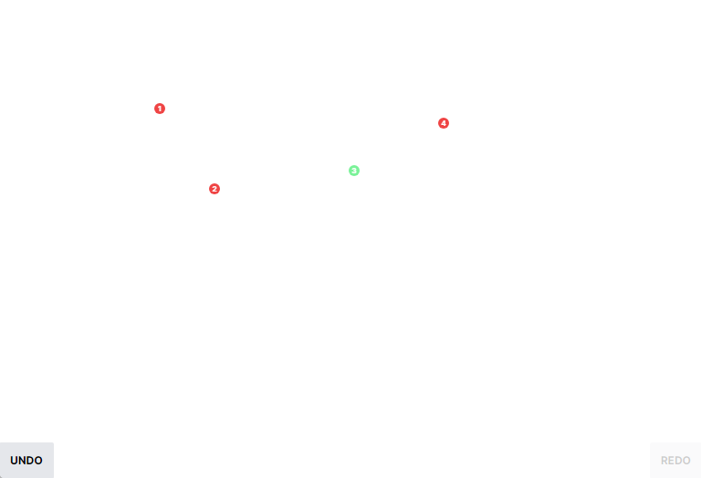

# Dot Marker Challenge

.

O desafio consistem em:

1. Criar uma aplicação React onde usuários possam clicar na tela e deixar um pontinho na localização clicada;
2. Esse ponto deve ter 12x12px e a sua numeração (em texto) de 8px com base na ordem de criação;
3. Existe o botão para desfazer o último ponto recém criado;
   - O usuário pode desfazer todos os pontos que foram criados até que não exista mais pontos para desfazer.
4. Existe o botão para refazer os pontos que foram desfeitos;
   - O usuário também pode refazer até que existam pontos para serem refeitos;
   - Sempre o usuário criar um novo ponto, não existirá mais nenhum ponto para ser refeito.
5. Ao clicar em um lugar onde já exista um ponto, esse ponto deve ser colorido de uma nova cor;
   - Toda vez que for clicado, uma nova cor será exibida;
   - Devem ter no mínimo três cores disponíveis;
   - O ciclo de cores pode reiniciar, mas nunca a mesma cor em seguida. Exemplo: vermelho, verde, azul e volta para o vermelho.
